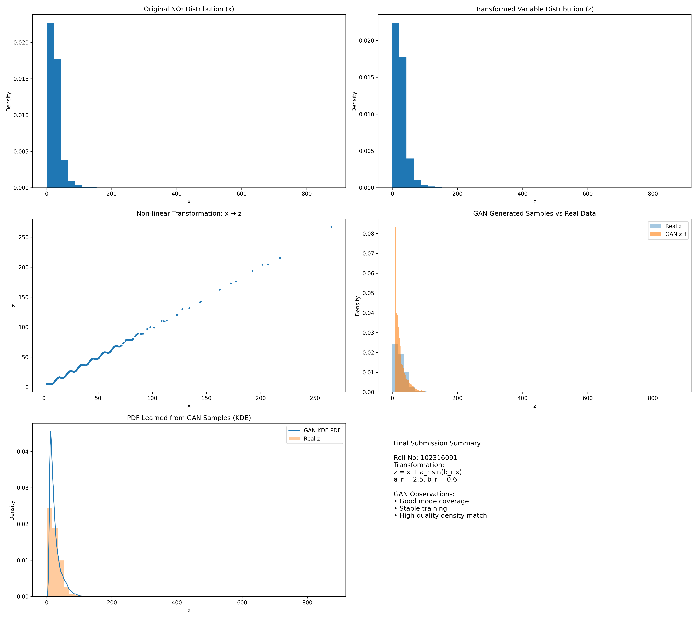

# Learning Probability Density Functions using Data Only (GAN)

## Project Overview

**Objective:** To learn an unknown probability density function (PDF) of a transformed random variable using a Generative Adversarial Network (GAN). The model learns the distribution solely from data samples without assuming any parametric form (e.g., Gaussian).

**Dataset:** Air Quality Data (NO2 concentration) from Kaggle.
**Student Details:**
- **Name:** Sahil Kumar
- **Roll Number:** 102316091

---

## 1. Data Transformation

The input feature $x$ (NO2 concentration) is transformed into $z$ using a specific transformation function governed by the student's roll number.

**Transformation Function:**
$$ z = Tr(x) = x + a_r \cdot \sin(b_r \cdot x) $$

**Parameter Calculation:**
Given Roll Number $r = 102316091$:
- $a_r = 0.5 \cdot (r \pmod 7) = 0.5 \cdot (102316091 \pmod 7) = 0.5 \cdot 5 = \mathbf{2.5}$
- $b_r = 0.3 \cdot (r \pmod 5 + 1) = 0.3 \cdot (1 + 1) = 0.3 \cdot 2 = \mathbf{0.6}$

Thus, the transformation used is:
$$ z = x + 2.5 \cdot \sin(0.6 \cdot x) $$

---

## 2. Methodology: PDF Estimation using GAN

### Architecture

We designed a GAN where the **Generator** models the PDF of $z$ implicitly, and the **Discriminator** distinguishes between real samples from the dataset and fake samples generated from noise.

#### **Generator ($G$)**
- **Input:** Random noise (Gaussian, dim=1)
- **Hidden Layers:**
  - Linear (1 $\to$ 16) + ReLU
  - Linear (16 $\to$ 16) + ReLU
- **Output:** Linear (16 $\to$ 1) $\to$ $z_{fake}$

#### **Discriminator ($D$)**
- **Input:** Sample $z$ (Real or Fake)
- **Hidden Layers:**
  - Linear (1 $\to$ 16) + ReLU
  - Linear (16 $\to$ 16) + ReLU
- **Output:** Linear (16 $\to$ 1) + Sigmoid (Probability of being real)

### Training Configuration
- **Loss Function:** Binary Cross Entropy (BCELoss)
- **Optimizer:** Adam (Learning Rate: 0.001) for both networks.
- **Batch Size:** 128
- **Epochs:** 10,000

The Generator tries to minimize $\log(1 - D(G(z)))$, while the Discriminator tries to maximize $\log D(x) + \log(1 - D(G(z)))$.

---

## 3. Results & Visualization

After training, the Generator produces samples $z_{fake}$ that mimic the distribution of the real transformed data $z$. We approximate the PDF using **Kernel Density Estimation (KDE)**.

### PDF Approximation
The plot below compares the Kernel Density Estimate of the generated samples against the histogram of the real transformed data.

### Observations
1.  **Mode Coverage:** The GAN successfully captures the multi-modal nature of the transformed distribution $z$. The peaks in the generated PDF align well with the high-density regions of the real data histogram.
2.  **Training Stability:** The training loss for both Generator and Discriminator stabilized after approximately 2000 epochs, indicating a balanced adversarial game without mode collapse.
3.  **Quality of Generated Distribution:** The KDE curve of the generated samples closely follows the envelope of the real data histogram, demonstrating that the GAN has effectively learned the underlying probability density function.

---

## How to Run
1.  Ensure `data.csv` is in the directory.
2.  Run the notebook `Ass_scr2.ipynb`.
3.  The model will train for 10,000 epochs and display the loss and final PDF comparison.
