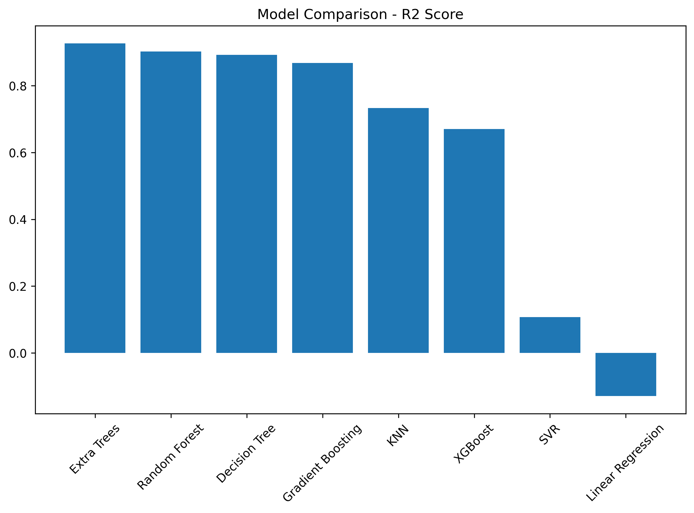
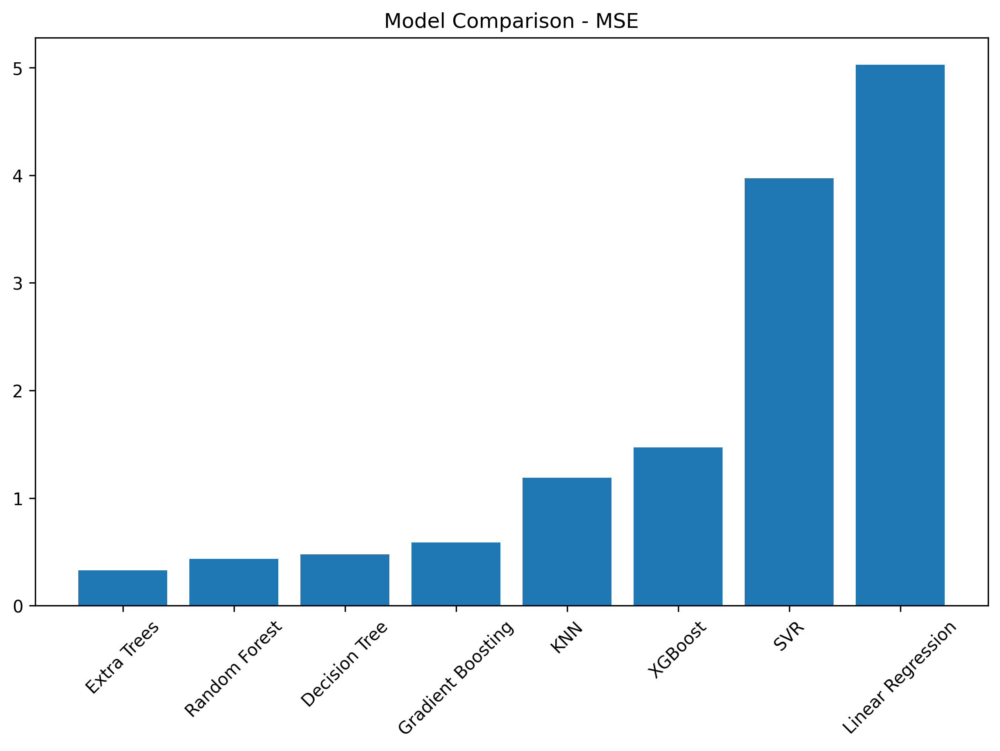
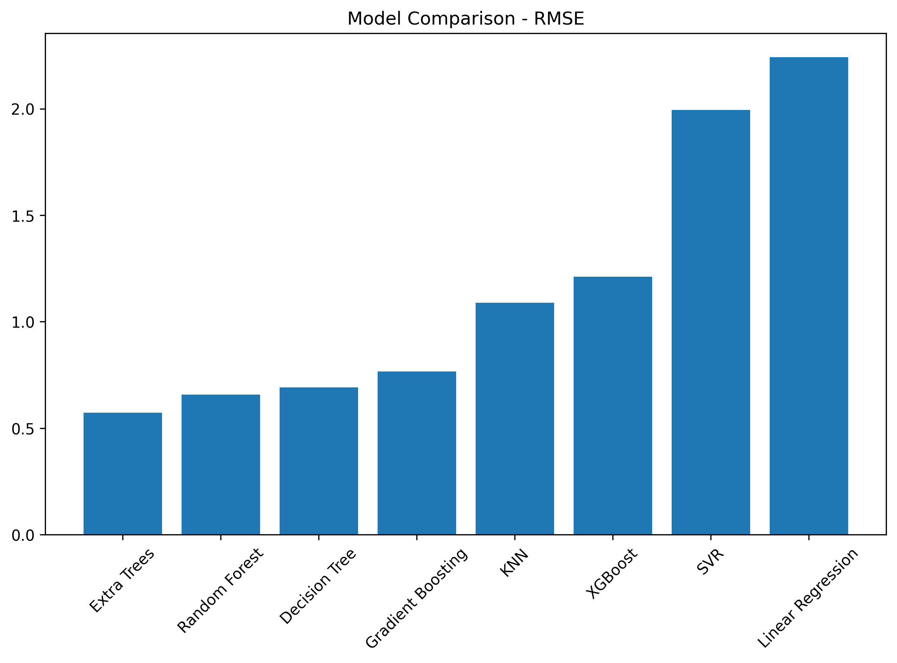

# 🏆 Assignment 6 — TOPSIS-Based Model Selection using Simulation Data

**Student:** Sahil Kumar | **Roll No:** 102316091  
**Course:** UCS 654 | **Assignment:** 6

---

## 📌 Assignment Objective

> **Step 1:** Find a relevant simulation tool/software/library/package of your interest.  
> **Step 2:** Install the simulator and explore it.  
> **Step 3:** Study the different relevant/important parameters and find their lower and upper bounds.  
> **Step 4:** Generate a random set of parameters, pass them to the simulator, and record the output value.  
> **Step 5:** Generate 1000 simulations.  
> **Step 6:** Generate a comparison table of 5–10 ML models on different evaluation parameters and report the best one using **TOPSIS**.

---

## 📦 Libraries & Tools Used

| Library | Purpose |
|--------|---------|
| `simpy` | Discrete-event simulation (hospital/queue model) |
| `numpy` | Numerical computations |
| `pandas` | Data management & CSV export |
| `matplotlib` | Result visualization |
| `scikit-learn` | ML model training & evaluation |
| `xgboost` | Gradient boosted tree model |

---

## 🔬 Simulation — Hospital Queue (SimPy)

### Tool: [SimPy](https://simpy.readthedocs.io/)

SimPy is a **process-based discrete-event simulation** framework written in Python. It was used here to model a **hospital queuing system**, where patients arrive, wait for a server (doctor/nurse), receive service, and leave.

### Parameters & Bounds

| Parameter | Lower Bound | Upper Bound |
|-----------|-------------|-------------|
| `arrival_rate` | 2 | 10 |
| `service_rate` | 5 | 15 |
| `num_servers` | 1 | 5 |

> 🔑 **Random seed** was set to `ROLL_NUMBER = 102316091` for reproducibility.

### How the Simulation Works

```python
def run_simulation(arrival_rate, service_rate, num_servers, sim_time=200):
    env = simpy.Environment()
    server = simpy.Resource(env, capacity=num_servers)
    waiting_times = []

    def patient(env):
        arrival_time = env.now
        with server.request() as request:
            yield request
            wait = env.now - arrival_time
            waiting_times.append(wait)
            service_time = np.random.exponential(1 / service_rate)
            yield env.timeout(service_time)

    def patient_generator(env):
        while True:
            yield env.timeout(np.random.exponential(1 / arrival_rate))
            env.process(patient(env))

    env.process(patient_generator(env))
    env.run(until=sim_time)
    return np.mean(waiting_times) if waiting_times else 0
```

Each simulation run returns the **average patient waiting time**, which becomes the **target variable** (`avg_waiting_time`) for the ML models.

---

## 📊 Dataset Generation (1000 Simulations)

For each of the 1000 simulation runs:
1. Random values for `arrival_rate`, `service_rate`, and `servers` are sampled uniformly from within their bounds.
2. The SimPy simulation is executed, and the **average waiting time** is recorded.
3. All records are stored in a DataFrame and saved as `simulation_data_102316091.csv`.

### Sample Data (First 5 Rows)

| arrival_rate | service_rate | servers | avg_waiting_time |
|-------------|--------------|---------|-----------------|
| 4.484662 | 9.754216 | 3 | 0.000808 |
| 5.459189 | 6.825219 | 3 | 0.003210 |
| 6.042321 | 14.223328 | 3 | 0.000131 |
| 9.942860 | 12.840037 | 3 | 0.001545 |
| 4.573254 | 6.559769 | 2 | 0.022153 |

---

## 🤖 ML Model Training & Evaluation

**Features (X):** `arrival_rate`, `service_rate`, `servers`  
**Target (y):** `avg_waiting_time`

**Train/Test Split:** 80% / 20% (`random_state = 102316091`)

### Models Evaluated

| # | Model |
|---|-------|
| 1 | Linear Regression |
| 2 | Decision Tree Regressor |
| 3 | Random Forest Regressor |
| 4 | Gradient Boosting Regressor |
| 5 | Extra Trees Regressor |
| 6 | Support Vector Regressor (SVR) |
| 7 | K-Nearest Neighbors (KNN) |
| 8 | XGBoost Regressor |

---

## 📈 Model Comparison Results

Each model was evaluated using 4 standard regression metrics:

- **R² Score** — Higher is better (max = 1.0)
- **MSE** — Mean Squared Error (lower is better)
- **RMSE** — Root Mean Squared Error (lower is better)
- **MAE** — Mean Absolute Error (lower is better)

### Results Table (sorted by R² Score)

| Model | R² Score | MSE | RMSE | MAE |
|-------|----------|-----|------|-----|
| **Extra Trees** | **0.9265** | **0.3274** | **0.5722** | **0.0933** |
| Random Forest | 0.9026 | 0.4336 | 0.6585 | 0.1186 |
| Decision Tree | 0.8925 | 0.4785 | 0.6918 | 0.1004 |
| Gradient Boosting | 0.8678 | 0.5884 | 0.7671 | 0.1841 |
| KNN | 0.7334 | 1.1869 | 1.0895 | 0.1538 |
| XGBoost | 0.6701 | 1.4688 | 1.2119 | 0.1599 |
| SVR | 0.1073 | 3.9742 | 1.9935 | 0.3148 |
| Linear Regression | -0.1291 | 5.0267 | 2.2420 | 1.4725 |

---

## 📊 Result Visualizations

### R² Score Comparison


### MSE Comparison


### RMSE Comparison


### MAE Comparison


---

## 🏆 TOPSIS Analysis — Best Model

TOPSIS (**T**echnique for **O**rder of **P**reference by **S**imilarity to **I**deal **S**olution) is a multi-criteria decision-making method that ranks alternatives by measuring their geometric distances from the **ideal** and **negative-ideal** solutions.

### Criteria for TOPSIS

| Metric | Weight | Type |
|--------|--------|------|
| R² Score | 0.25 | Benefit (higher is better) |
| MSE | 0.25 | Cost (lower is better) |
| RMSE | 0.25 | Cost (lower is better) |
| MAE | 0.25 | Cost (lower is better) |

### TOPSIS Procedure

1. **Normalize** the decision matrix
2. **Weight** the normalized matrix
3. Determine the **Positive Ideal Solution (PIS)** and **Negative Ideal Solution (NIS)**
4. Calculate **Euclidean distances** from PIS and NIS
5. Rank by **closeness coefficient** (higher = better)

### 🥇 TOPSIS Result: **Extra Trees Regressor** is the Best Model

Extra Trees achieved the highest R² (0.9265) and the lowest MSE, RMSE, and MAE among all 8 models, making it the top-ranked model in both the raw comparison table and the TOPSIS analysis.

---

## 📂 Output Files

| File | Description |
|------|-------------|
| `simulation_data_102316091.csv` | 1000 simulation records (features + target) |
| `model_comparison_102316091.csv` | ML model results table |
| `images/r2_plot_102316091.png` | Bar chart: R² Score across models |
| `images/mse_plot_102316091.png` | Bar chart: MSE across models |
| `images/rmse_plot_102316091.png` | Bar chart: RMSE across models |
| `images/mae_plot_102316091.png` | Bar chart: MAE across models |

---

## 🚀 How to Run

1. Open `Assingment6_Topsis.ipynb` in **Google Colab** or Jupyter.
2. Install dependencies:
   ```bash
   pip install simpy xgboost
   ```
3. Run all cells sequentially.
4. Output CSVs and plots will be saved automatically.

---

## ✅ Conclusion

This assignment demonstrated a complete pipeline of **simulation-based data generation** and **ML model comparison using TOPSIS**:

- **SimPy** was used to model a hospital queuing system and generate realistic data.
- **8 ML models** were trained and evaluated across 4 metrics.
- **TOPSIS** was applied to objectively identify the best model.
- 🏆 **Extra Trees Regressor** emerged as the best model with an **R² of 0.9265**, significantly outperforming linear models and even XGBoost for this dataset.
