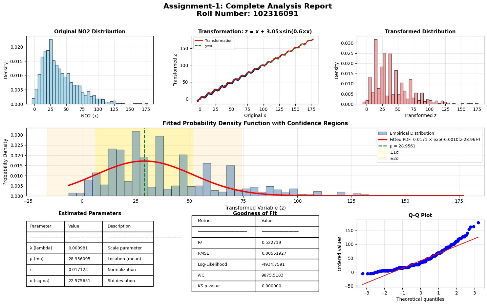

# Analysis of India Air Quality Data (NO2)

## 📌 Student Information
- **Roll Number**: 102316091
- **Assignment**: 2

## 📝 Problem Statement
The objective of this assignment is to analyze the probability density function (PDF) of Nitrogen Dioxide (NO2) levels from the India Air Quality dataset. The analysis involves transforming the original data feature using a specific mathematical function derived from the student's roll number and then learning the parameters of a target PDF model.

## ⚙️ Methodology

### 1. Data Transformation
The original NO2 values ($x$) were transformed into a new variable ($z$) using the following roll-number-based transformation:

$$ z = T_r(x) = x + a_r \sin(b_r x) $$

Base on Roll Number **102316091**:
- $a_r = 0.05 + (102316091 \mod 7) = 3.05$
- $b_r = 0.3 \times (102316091 \mod 5 + 1) = 0.6$

**Final Transformation:**
$$ z = x + 3.05 \sin(0.6 x) $$

### 2. Model Fitting
We fitted a generalized Exponential/Gaussian-like probability density function to the transformed data ($z$):

$$ \hat{p}(z) = c \cdot e^{-\lambda(z-\mu)^2} $$

The parameters $\lambda$, $\mu$, and $c$ were estimated to best fit the empirical distribution of the transformed data.

## 📊 Results

### Estimated Parameters
| Parameter | Symbol | Value | Description |
|-----------|--------|-------|-------------|
| **Lambda** | $\lambda$ | **0.000981** | Scale parameter (inverse variance related) |
| **Mu** | $\mu$ | **28.956095** | Location parameter (mean) |
| **C** | $c$ | **0.017123** | Normalization constant |

### Derived Statistics
- **Sigma ($\sigma$):** 22.575651
- **Variance ($\sigma^2$):** 509.660012

### Goodness of Fit
- **$R^2$ Score:** 0.5227
- **RMSE:** 0.0055
- **Log-Likelihood:** -4934.76
- **AIC:** 9875.52
- **BIC:** 9890.24

## 📈 Visualizations



*Figure 1: Complete analysis report showing original distribution, transformation effect, transformed distribution, and the fitted PDF against empirical data.*

## 🚀 How to Run

1.  **Prerequisites**: Ensure you have Python installed with the following libraries:
    ```bash
    pip install numpy pandas matplotlib seaborn scipy
    ```
2.  **Dataset**: Download the `city_day.csv` file from Kaggle (India Air Quality Data) and place it in the same directory.
3.  **Run the Notebook**: Open `Assingment_2_102316091.ipynb` in [Google Colab](https://colab.research.google.com/) or Jupyter Notebook and execute all cells sequentially.

---
*Generated for Assignment 2 Submission*
