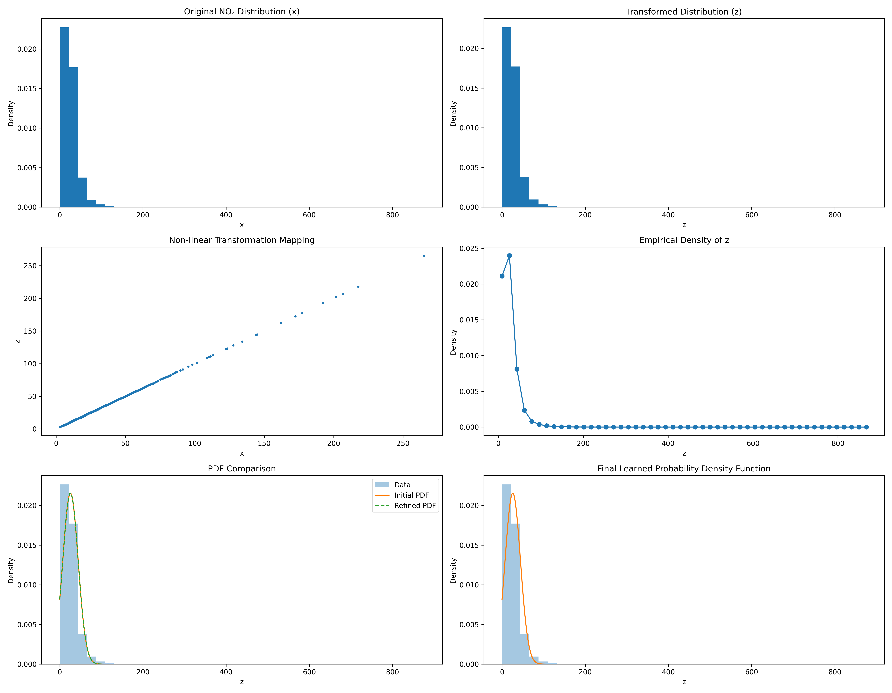

# Assignment-2: Learn Probability Density Functions

## 📌 Student Information
- **Roll Number**: 102316091
- **Name**: Sahil Kumar

## 📝 Problem Statement
The goal of this assignment is to learn the **Probability Density Function (PDF)** for a transformed variable derived from the **NO2** feature of the India Air Quality dataset. The assignment involves data transformation and parameter estimation using a specific non-linear model.

## ⚙️ Methodology

### 1. Data Transformation
The original NO2 values ($x$) are transformed into a new variable ($z$) using a non-linear transformation function specific to the student's roll number.

**Transformation Function:**
$$ z = T_r(x) = x + a_r \sin(b_r x) $$

**Parameters for Roll No. 102316091:**
- $r = 102316091$
- $a_r = 0.05 \times (r \pmod 7) = 0.05 \times 5 = \mathbf{0.25}$
- $b_r = 0.3 \times (r \pmod 5 + 1) = 0.3 \times 2 = \mathbf{0.6}$

**Final Equation:**
$$ z = x + 0.25 \sin(0.6 x) $$

### 2. Parameter Estimation
We fit the transformed data $z$ to the following Probability Density Function:

$$ \hat{p}(z) = c \cdot e^{-\lambda(z-\mu)^2} $$

The parameters $\lambda, \mu, c$ are estimated using the **Method of Moments** (using mean and variance of $z$):
- $\mu \approx \text{Mean}(z)$
- $\lambda \approx \frac{1}{2 \cdot \text{Variance}(z)}$
- $c \approx \frac{1}{\sqrt{\pi / \lambda}}$

## 📊 Results

The estimated parameters for the fitted PDF are:

| Parameter | Symbol | Value |
|-----------|--------|-------|
| **Lambda** | $\lambda$ | **0.001461** |
| **Mu** | $\mu$ | **25.812662** |
| **C** | $c$ | **0.021562** |

## 📈 Visualizations

The analysis includes the following visualizations generated in the notebook:
1.  **Original vs. Transformed Distribution**: Histograms comparing $x$ and $z$.
2.  **Transformation Mapping**: Scatter plot showing the non-linear relationship.
3.  **Empirical Probability Density**: Density plot of the transformed variable.
4.  **Fitted PDF**: Overlay of the estimated PDF on the data histogram.

### Final Report

## 🚀 How to Run
1.  **Dataset**: Ensure `city_day.csv` is available.
2.  **Run**: Execute the notebook `2nd_102316091 (1).ipynb` to perform the transformation and estimation.
3.  **Output**: The code prints the estimated parameters and generates the plots.

---
*Assignment submission for Roll No: 102316091*

